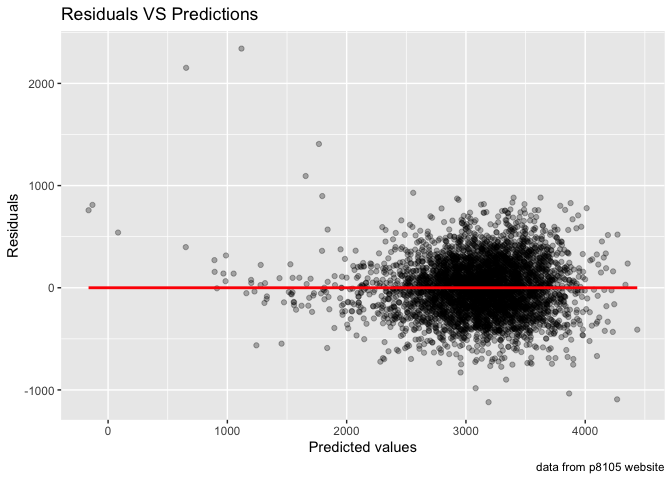
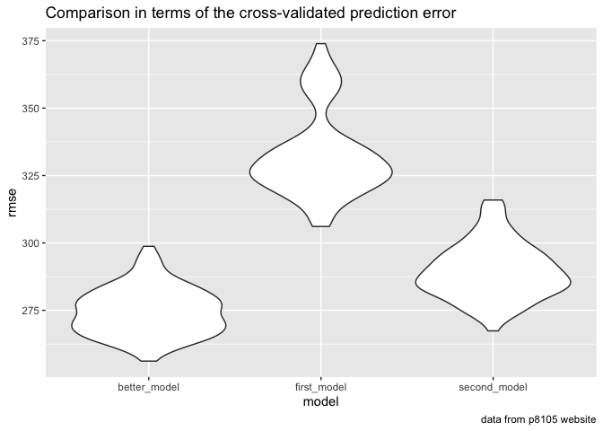

HW6
================
Weize Sun
12/4/2021

``` r
library(tidyverse)
```

    ## ── Attaching packages ─────────────────────────────────────── tidyverse 1.3.1 ──

    ## ✓ ggplot2 3.3.5     ✓ purrr   0.3.4
    ## ✓ tibble  3.1.4     ✓ dplyr   1.0.7
    ## ✓ tidyr   1.1.3     ✓ stringr 1.4.0
    ## ✓ readr   2.0.1     ✓ forcats 0.5.1

    ## ── Conflicts ────────────────────────────────────────── tidyverse_conflicts() ──
    ## x dplyr::filter() masks stats::filter()
    ## x dplyr::lag()    masks stats::lag()

``` r
library(modelr)
library(mgcv)
```

    ## Loading required package: nlme

    ## 
    ## Attaching package: 'nlme'

    ## The following object is masked from 'package:dplyr':
    ## 
    ##     collapse

    ## This is mgcv 1.8-36. For overview type 'help("mgcv-package")'.

``` r
library(broom)
```

    ## 
    ## Attaching package: 'broom'

    ## The following object is masked from 'package:modelr':
    ## 
    ##     bootstrap

``` r
library(dbplyr)
```

    ## 
    ## Attaching package: 'dbplyr'

    ## The following objects are masked from 'package:dplyr':
    ## 
    ##     ident, sql

## Problem 1

### load and clean data

``` r
birthweight = 
  read.csv("./data/birthweight.csv") %>% 
  janitor::clean_names() %>% 
  mutate(babysex = as.factor(babysex),
         frace = as.factor(frace),
         malform = as.factor(malform),
         mrace = as.factor(mrace))
sum(is.na(birthweight))
```

    ## [1] 0

There is no missing value in this dataset.

### Propose a regression model for birthweight

``` r
birthweight_model = 
  lm(bwt ~ babysex + bhead + blength + delwt + fincome + frace + gaweeks + malform + menarche + mheight + momage + mrace + parity + pnumlbw + pnumsga + ppbmi + ppwt + smoken + wtgain, data = birthweight) 
broom::tidy(birthweight_model) %>% 
  knitr::kable(digits = 3)
```

| term        |  estimate | std.error | statistic | p.value |
|:------------|----------:|----------:|----------:|--------:|
| (Intercept) | -6265.391 |   660.401 |    -9.487 |   0.000 |
| babysex2    |    28.707 |     8.465 |     3.391 |   0.001 |
| bhead       |   130.778 |     3.452 |    37.881 |   0.000 |
| blength     |    74.954 |     2.022 |    37.075 |   0.000 |
| delwt       |     4.101 |     0.395 |    10.386 |   0.000 |
| fincome     |     0.290 |     0.180 |     1.614 |   0.107 |
| frace2      |    14.331 |    46.150 |     0.311 |   0.756 |
| frace3      |    21.236 |    69.296 |     0.306 |   0.759 |
| frace4      |   -46.996 |    44.678 |    -1.052 |   0.293 |
| frace8      |     4.297 |    74.074 |     0.058 |   0.954 |
| gaweeks     |    11.549 |     1.465 |     7.882 |   0.000 |
| malform1    |     9.765 |    70.626 |     0.138 |   0.890 |
| menarche    |    -3.551 |     2.895 |    -1.226 |   0.220 |
| mheight     |     9.787 |    10.312 |     0.949 |   0.343 |
| momage      |     0.759 |     1.222 |     0.621 |   0.534 |
| mrace2      |  -151.435 |    46.045 |    -3.289 |   0.001 |
| mrace3      |   -91.387 |    71.919 |    -1.271 |   0.204 |
| mrace4      |   -56.479 |    45.137 |    -1.251 |   0.211 |
| parity      |    95.541 |    40.479 |     2.360 |   0.018 |
| pnumlbw     |        NA |        NA |        NA |      NA |
| pnumsga     |        NA |        NA |        NA |      NA |
| ppbmi       |     4.354 |    14.891 |     0.292 |   0.770 |
| ppwt        |    -3.472 |     2.612 |    -1.329 |   0.184 |
| smoken      |    -4.854 |     0.587 |    -8.269 |   0.000 |
| wtgain      |        NA |        NA |        NA |      NA |

### Describe my modeling process

I hypothesized all variables (besides bwt) to be predictors of this
regression model. Then, I found that there are three predictors which
give NA value, which are pnumlbw, pnumsga, and wtgain. Hence, I will not
chose them as predictors.

Besides, I also found that p-value for fincome, frace, malform,
menarche, mheight, momage, mrace(3&4), ppbmi and ppwt are greater than
0.05, and in this case we failed to reject the null hypothesis. Hence, I
will also ombit these as predictors.

``` r
better_model =
  lm(bwt ~ babysex + bhead + blength + delwt + gaweeks + mrace + parity + smoken, data = birthweight)
broom::tidy(better_model) %>% 
  knitr::kable(digits = 3)
```

| term        |  estimate | std.error | statistic | p.value |
|:------------|----------:|----------:|----------:|--------:|
| (Intercept) | -5822.593 |    98.832 |   -58.914 |   0.000 |
| babysex2    |    28.661 |     8.495 |     3.374 |   0.001 |
| bhead       |   131.698 |     3.461 |    38.056 |   0.000 |
| blength     |    75.865 |     2.021 |    37.538 |   0.000 |
| delwt       |     2.265 |     0.196 |    11.550 |   0.000 |
| gaweeks     |    12.140 |     1.465 |     8.284 |   0.000 |
| mrace2      |  -146.789 |     9.243 |   -15.880 |   0.000 |
| mrace3      |   -71.588 |    42.481 |    -1.685 |   0.092 |
| mrace4      |  -119.598 |    18.766 |    -6.373 |   0.000 |
| parity      |    98.611 |    40.533 |     2.433 |   0.015 |
| smoken      |    -4.747 |     0.588 |    -8.071 |   0.000 |

### Show a plot of model residuals against fitted values

``` r
birthweight %>% 
  modelr::add_predictions(better_model) %>% 
  modelr::add_residuals(better_model) %>% 
  ggplot(aes(x = pred, y = resid)) + 
  geom_point(alpha = .3) + 
  geom_smooth(method = "lm", color = "red", se = FALSE) +
  labs(
    x = "Predicted values",
    y = "Residuals",
    title = "Residuals VS Predictions",
    caption = "data from p8105 website"
  )
```

    ## `geom_smooth()` using formula 'y ~ x'

<!-- -->

### Compare my model to two others

``` r
first_model = lm(bwt ~ blength + gaweeks, data = birthweight)
second_model = lm(bwt ~ bhead * blength * babysex, data = birthweight)
```

``` r
cv_df =
  crossv_mc(birthweight, 100) %>% 
  mutate(
    train = map(train, as_tibble),
    test = map(test, as_tibble))
cv_df = 
  cv_df %>% 
  mutate(
    better_model = map(train, ~lm(bwt ~ babysex + bhead + blength + delwt + gaweeks + mrace + parity + smoken, data = .x)),
    first_model = map(train, ~lm(bwt ~ blength + gaweeks, data = .x)),
    second_model = map(train, ~gam(bwt ~ bhead * blength * babysex, data = as_tibble(.x)))) %>% 
  mutate(
    rmse_better_model = map2_dbl(better_model, test, ~rmse(model = .x, data = .y)),
    rmse_first_model = map2_dbl(first_model, test, ~rmse(model = .x, data = .y)),
    rmse_second_model = map2_dbl(second_model, test, ~rmse(model = .x, data = .y)))
```

    ## Warning in predict.lm(model, data): prediction from a rank-deficient fit may be
    ## misleading

``` r
cv_df %>% 
  select(starts_with("rmse")) %>% 
  pivot_longer(
    everything(),
    names_to = "model", 
    values_to = "rmse",
    names_prefix = "rmse_") %>% 
  mutate(model = fct_inorder(model)) %>% 
  ggplot(aes(x = model, y = rmse)) + 
  geom_violin() +
  labs(
    title = "Comparison in terms of the cross-validated prediction error",
    caption = "data from p8105 website"
  )
```

<!-- -->
